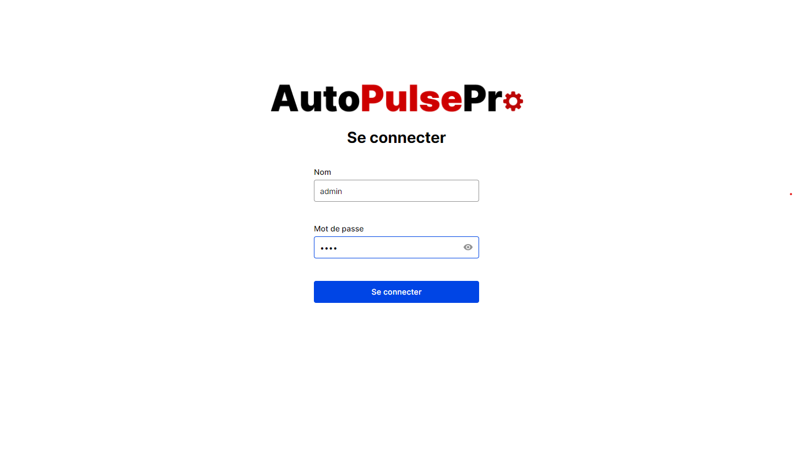

# ZAUTO MANAGER



A car dealership software that helps manage their business

## Getting Started

These instructions will get you a copy of the project up and running on your local machine for development and testing purposes. See deployment for notes on how to deploy the project on a live system.

### Prerequisites

You need to create three folders one for database called **db** and one for uploaded thumbnails called **uploads** and one for env files called **env**.

In the root path create three folders:

**db/** \
**env/** \
**uploads/**

**Note:** In production you need to copy the db and env folders and put them two folders above the software installed file location, so when you install new update it won't override the latest database file.

**Example:**

**Software installed file location:** \
_C:\Users\user\AppData\Local\Programs\zauto-manager_

**Folders location must be:** \
_C:\Users\user\AppData\Local\db_ \
_C:\Users\user\AppData\Local\env_

Also you need to create _.env_ file inside **env** folder and create two variables:

```env
JWT_SECRET=YOUR_JWT_SECRET
JWT_EXPIRES_IN=YOUR_JWT_EXPIRES_IN
```

And you need to create _.env.local_ file inside **renderer** folder and create three variables:

```env
NEXT_PUBLIC_EMAIL=EMAIL_EXAMPLE_OF_YOUR_COMPANY
NEXT_PUBLIC_PHONES=PHONES_EXAMPLE_OF_YOUR_COMPANY
NEXT_PUBLIC_ADDRESS=ADDRESS_EXAMPLE_OF_YOUR_COMPANY
```

### Installing

Clone the Repository and run

```bash
npm install
```

Then navigate to **backend/** and run

```bash
npm install
```

## Setup

In your terminal in the root path run to create db.db file with initial tables

```bash
nodemon backend/database.ts
```

Then run below command to create user to login

```bash
nodemon backend/utils/createUser.ts
```

## Dev

```bash
npm run dev
```

### Build

To build simply run

```bash
npm run build
```

### Production

To install the software simply run the install file from the **dist** folder generated in by the _build_

### Contributing

Please feel free to send pull request if you want to contribute!
